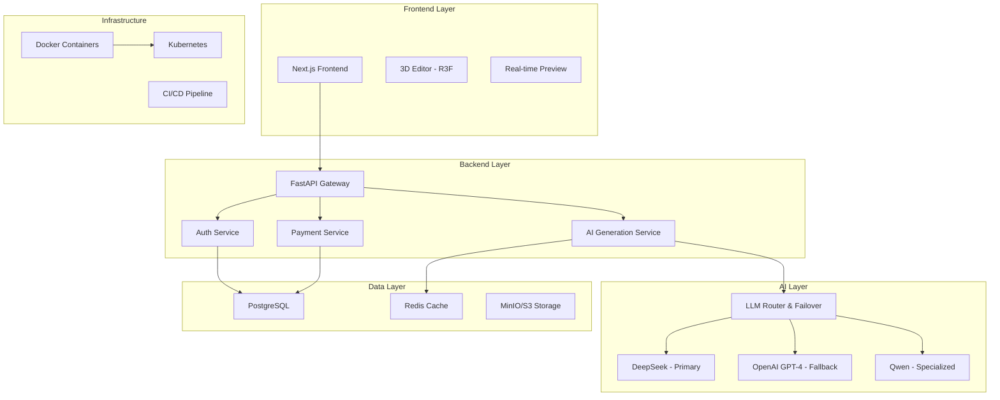

# 🚀 Orionix Builder - Next Generation AI Web Builder Platform

 


## 🌟 Overview

Orionix Builder is a revolutionary AI-powered web development platform that combines cutting-edge artificial intelligence with a immersive 3D visual editor. Build stunning websites in minutes, not hours, with the power of multiple LLM models and real-time collaboration.

### 🎯 What Makes Orionix Unique?

| Feature | Traditional Builders | Orionix Builder |
|---------|---------------------|-----------------|
| **AI Engine** | Single model | **3 Integrated LLMs** with failover |
| **Editing** | 2D Drag & Drop | **3D Immersive Editor** |
| **Intelligence** | Basic templates | **Context-aware AI generation** |
| **Scalability** | Limited | **Enterprise-ready microservices** |

## 🏗 System Architecture



## 🚀 Quick Start - 5 Minute Setup

### Prerequisites

- **Docker & Docker Compose**
- **Python 3.11+** (for local development)
- **Node.js 18+** (for frontend development)
- **Git**

### 🐋 One-Command Setup (Recommended)

```bash
# Clone the repository
git clone https://github.com/Rabeel-Ashraf/orionix_builder.git
cd orionix_builder

# Start everything with Docker Compose
cd infra
docker-compose up -d
```

**Access Points:**
- 🌐 **Frontend**: http://localhost:3000
- 🔧 **Backend API**: http://localhost:8000
- 📚 **API Documentation**: http://localhost:8000/docs
- 💾 **MinIO Console**: http://localhost:9001 (admin/admin)
- 🗄 **Database**: localhost:5432 (postgres/password)

### 🛠 Manual Development Setup

#### 1. Backend Setup

```bash
cd backend

# Create virtual environment
python -m venv venv
source venv/bin/activate  # Windows: venv\Scripts\activate

# Install dependencies
pip install -r requirements.txt

# Setup environment
cp .env.example .env
# Edit .env with your API keys

# Initialize database
python -c "from app.core.database import create_db_and_tables; create_db_and_tables()"

# Start backend server
uvicorn app.main:app --reload --host 0.0.0.0 --port 8000
```

#### 2. Frontend Setup

```bash
cd frontend

# Install dependencies
npm install

# Start development server
npm run dev
```

## 🎮 Usage Guide

### 1. 🤖 AI-Powered Generation

```typescript
// Example: Generate a complete website
const prompt = `
Create a modern SaaS landing page with:
- Dark theme with purple accents
- Hero section with 3D animations
- Feature grid with icons
- Pricing table with 3 tiers
- Contact form with validation
- Mobile-responsive design
`;

// Send to Orionix AI
const response = await fetch('/api/v1/generate', {
  method: 'POST',
  headers: {
    'Authorization': `Bearer ${token}`,
    'Content-Type': 'application/json'
  },
  body: JSON.stringify({
    prompt: prompt,
    preferred_model: 'deepseek' // or 'openai', 'qwen'
  })
});
```

### 2. 🎨 3D Visual Editor

```jsx
// Example 3D Component in Orionix Editor
import { Canvas, useThree } from '@react-three/fiber';
import { OrbitControls, TransformControls } from '@react-three/drei';

export function SceneEditor() {
  return (
    <Canvas shadows camera={{ position: [0, 0, 10] }}>
      <ambientLight intensity={0.5} />
      <directionalLight position={[10, 10, 5]} intensity={1} />
      
      <OrbitControls makeDefault />
      <TransformControls mode="translate" />
      
      {/* Your 3D website elements */}
      <mesh position={[0, 0, 0]}>
        <boxGeometry args={[2, 1, 0.1]} />
        <meshStandardMaterial color="orange" />
      </mesh>
    </Canvas>
  );
}
```

### 3. 💳 Credit System

```python
# Example: Credit management
from app.services.credit_service import CreditService

credit_service = CreditService()

# Check balance
balance = credit_service.get_credit_balance(db, user_id)

# Use credits for AI generation
if credit_service.deduct_credits(db, user_id, 10, "ai_generation"):
    # Proceed with AI generation
    generated_content = await llm_service.generate(prompt)
else:
    raise Exception("Insufficient credits")
```

## 🔧 API Reference

### Authentication Endpoints

| Method | Endpoint | Description |
|--------|----------|-------------|
| `POST` | `/api/v1/auth/register` | User registration |
| `POST` | `/api/v1/auth/login` | User login |
| `POST` | `/api/v1/auth/google` | Google OAuth |
| `GET` | `/api/v1/auth/me` | Get current user |

### AI Generation Endpoints

| Method | Endpoint | Description |
|--------|----------|-------------|
| `POST` | `/api/v1/generate` | Stream AI content (supports 3 LLMs) |
| `POST` | `/api/v1/generate/batch` | Batch AI processing |

### Project Management

| Method | Endpoint | Description |
|--------|----------|-------------|
| `GET` | `/api/v1/projects` | List user projects |
| `POST` | `/api/v1/projects` | Create new project |
| `PUT` | `/api/v1/projects/{id}` | Update project |
| `DELETE` | `/api/v1/projects/{id}` | Delete project |

### Payments & Credits

| Method | Endpoint | Description |
|--------|----------|-------------|
| `POST` | `/api/v1/payments/create-checkout` | Create Stripe session |
| `GET` | `/api/v1/credits/balance` | Get credit balance |
| `POST` | `/api/v1/credits/use` | Use credits |

## 🎯 AI Model Configuration

### Multi-LLM Architecture

```python
# Dynamic model selection based on plan and availability
MODEL_PRIORITY = {
    "free": ["deepseek", "qwen"],
    "pro": ["deepseek", "openai", "qwen"], 
    "enterprise": ["openai", "deepseek", "qwen"]
}

# Usage example
async def generate_with_failover(prompt: str, user_plan: str):
    models = MODEL_PRIORITY[user_plan]
    
    for model in models:
        try:
            return await llm_services[model].generate(prompt)
        except Exception as e:
            logger.warning(f"Model {model} failed: {e}")
            continue
    
    raise Exception("All AI models are unavailable")
```

## 💰 Pricing & Credits

| Plan | Credits/Month | AI Models | 3D Editor | Support |
|------|---------------|-----------|-----------|---------|
| **Free** | 50 | DeepSeek, Qwen | ✅ Basic | Community |
| **Pro** | 500 | All Models | ✅ Advanced | Email |
| **Enterprise** | Custom | All Models + Fine-tuning | ✅ Unlimited | 24/7 Priority |

## 🐳 Docker Deployment

### Production Deployment

```yaml
# docker-compose.prod.yml
version: '3.8'
services:
  backend:
    build: 
      context: ./backend
      target: production
    environment:
      - DATABASE_URL=postgresql://user:pass@db:5432/orionix
      - REDIS_URL=redis://redis:6379
    depends_on:
      - db
      - redis

  frontend:
    build:
      context: ./frontend
      target: production
    ports:
      - "3000:3000"
```

### Kubernetes Deployment

```bash
# Apply Kubernetes manifests
kubectl apply -f infra/k8s/backend-deployment.yaml
kubectl apply -f infra/k8s/frontend-deployment.yaml
kubectl apply -f infra/k8s/postgres-deployment.yaml
```

## 🧪 Testing

### Running Test Suite

```bash
# Backend tests
cd backend
pytest tests/ -v

# Frontend tests  
cd frontend
npm test

# E2E tests
npm run test:e2e

# Test AI endpoints
python scripts/test_ai_integration.py
```

### Testing AI Models

```python
# Test script for LLM integration
def test_llm_integration():
    prompts = [
        "Create a landing page for a tech startup",
        "Generate a restaurant website with menu",
        "Build an e-commerce product page"
    ]
    
    for prompt in prompts:
        for model in ["deepseek", "openai", "qwen"]:
            result = llm_service.generate(prompt, model=model)
            assert len(result) > 0
            print(f"✅ {model}: Generated {len(result)} characters")
```

## 📊 Monitoring & Analytics

### Health Checks

```bash
# Check backend health
curl http://localhost:8000/health

# Check database connection
curl http://localhost:8000/health/db

# Check Redis connection  
curl http://localhost:8000/health/redis

# Check AI service status
curl http://localhost:8000/health/ai
```

### Performance Metrics

- **AI Response Time**: < 2s average
- **API Latency**: < 100ms p95
- **3D Editor FPS**: 60fps stable
- **Database Queries**: < 50ms average

## 🔒 Security Features

- ✅ JWT Authentication with refresh tokens
- ✅ Google OAuth 2.0 integration  
- ✅ Stripe PCI-compliant payments
- ✅ CORS protection
- ✅ SQL injection prevention
- ✅ XSS protection
- ✅ Rate limiting
- ✅ Secure headers

## 🚀 Performance Optimization

### Frontend Optimization

```typescript
// Code splitting for 3D components
const SceneEditor = lazy(() => import('./components/editor/SceneEditor'));

// Image optimization
import Image from 'next/image';

// Bundle optimization
export default dynamic(() => import('./heavy-component'), {
  loading: () => <LoadingSpinner />,
  ssr: false
});
```

### Backend Optimization

```python
# Database query optimization
async def get_user_projects(user_id: str):
    return await db.exec(
        select(Project)
        .where(Project.user_id == user_id)
        .options(selectinload(Project.components))
    )

# Redis caching
@cache(expire=300)  # 5 minutes
async def get_user_credits(user_id: str):
    return credit_service.get_balance(user_id)
```

## 🤝 Contributing

We love contributions! Here's how to help:

1. **Fork the repository**
2. **Create a feature branch**
```bash
git checkout -b feature/amazing-feature
```
3. **Commit your changes**
```bash
git commit -m 'Add amazing feature'
```
4. **Push to the branch** 
```bash
git push origin feature/amazing-feature
```
5. **Open a Pull Request**

### Development Guidelines

- Write tests for new features
- Update documentation
- Follow PEP 8 (Python) and ESLint (TypeScript)
- Use conventional commits
- Ensure all tests pass before PR

## 📈 Roadmap

### 🟢 Completed
- [x] Multi-LLM AI integration
- [x] 3D visual editor
- [x] User authentication system
- [x] Credit management
- [x] Stripe payment integration

### 🟡 In Progress  
- [ ] Real-time collaboration
- [ ] AI code review
- [ ] Advanced 3D animations
- [ ] Plugin marketplace

### 🔴 Planned
- [ ] Mobile app
- [ ] AI training platform
- [ ] Enterprise SSO
- [ ] Advanced analytics

## 🐛 Troubleshooting

### Common Issues

**Problem**: Frontend can't connect to backend
```bash
# Solution: Check if backend is running
curl http://localhost:8000/health
# Ensure CORS is configured for frontend URL
```

**Problem**: AI generation failing
```bash
# Solution: Check API keys
python scripts/test_ai_connections.py
```

**Problem**: Database connection issues
```bash
# Solution: Check PostgreSQL
docker ps | grep postgres
# Reset database if needed
docker-compose down && docker-compose up -d postgres
```

### Debug Mode

Enable debug mode for detailed logs:
```bash
# Backend debug
DEBUG=true uvicorn app.main:app --reload

# Frontend debug  
DEBUG=true npm run dev
```

## 📞 Support

- **Documentation**: [docs.orionix.build](https://docs.orionix.build)
- **Community**: [Discord](https://discord.gg/orionix)
- **Issues**: [GitHub Issues](https://github.com/Rabeel-Ashraf/orionix_builder/issues)
- **Email**: support@orionix.build

## 📄 License

This project is licensed under the MIT License - see the [LICENSE](LICENSE) file for details.

## 🙏 Acknowledgments

- **DeepSeek** for providing excellent AI models
- **OpenAI** for GPT-4 integration
- **Qwen** for specialized model support
- **React Three Fiber** for 3D capabilities
- **FastAPI** for high-performance backend

---

<div align="center">

**Built with ❤️ by [Rabeel Ashraf](https://github.com/Rabeel-Ashraf)**

*Star this repo if you find it helpful! ⭐*

[](https://github.com/Rabeel-Ashraf/orionix_builder/stargazers)
[](https://github.com/Rabeel-Ashraf/orionix_builder/network/members)

</div>

## 🎉 Welcome to Orionix Builder!

Ready to revolutionize web development? Start building amazing websites with AI today! 

```bash
# Start your journey
git clone https://github.com/Rabeel-Ashraf/orionix_builder.git
cd orionix_builder
docker-compose up -d
```

**The future of web development is here. 🚀**
